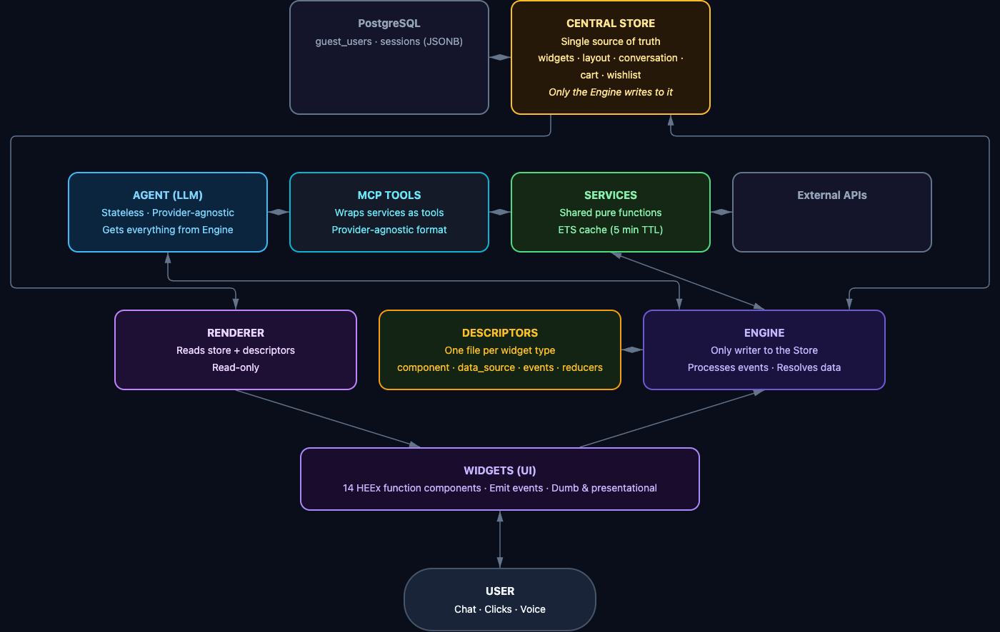

# Agentic UI

**The missing link between traditional web interfaces and conversational AI.**

Turn any interface into a conversational experience — without sacrificing the interface. Your app works fully on its own. The agent doesn't replace the UI, it inhabits it: browsing, composing, and rearranging widgets in real time alongside the user. When the agent is off, everything still works. When it's on, the entire interface becomes a conversation.

This is not a chatbot with buttons. This is a complete, functional UI where an AI agent and a human share the same workspace, the same state, and the same actions — each playing to their strengths.

> Built for any business: e-commerce, catalogs, dashboards, internal tools. Swap the widgets, swap the prompt, and it's yours.

---

### Built with Claude, built for Claude

This entire application was written using [Claude Code](https://claude.com/claude-code). Not a single line of code was written without Claude. Not as an experiment — as a deliberate choice.

It was also designed so that **you** can do the same. Clone the repo, open Claude Code, and start adapting it to your business. The `business/` directory is your playground: widgets, descriptors, tools, prompts — everything you need to customize lives there, structured so an LLM can understand and modify it naturally.

The choice of Elixir and Phoenix is not trivial. Elixir runs on the BEAM VM — the same battle-tested runtime that powers telecom infrastructure handling millions of simultaneous connections. Phoenix LiveView gives us native WebSocket support, server-rendered real-time UI with minimal diffs over the wire, and a concurrency model where each user session is an isolated lightweight process (not an OS thread). The result: real-time agent-to-UI communication, fault tolerance, hot code reloading, and the ability to handle massive concurrency — all without a single line of JavaScript for the interactive layer. No REST API glue between frontend and backend, no client-side state management library, no build pipeline for a separate SPA. One language, one process, full stack.

Some architectural decisions were made with this reality in mind. We chose a single Elixir monolith instead of splitting into separate apps for each layer (API, agent, frontend). Internally it's designed with clean separation — store, engine, agent, web — but it lives in one repo, one process, one deployment. This lets a single person working with an LLM move as fast as possible instead of juggling changes across multiple repositories. Certain traditional best practices — designed for humans reading and writing code — were intentionally traded for patterns that work better when an LLM is your primary coding partner. The world is changing fast, and this project was built for where things are going, not where they've been.

---

## Quick Start

### 1. Install prerequisites

**macOS:**
```bash
# Elixir + Erlang
brew install elixir

# Docker (via Colima — lightweight Docker runtime for Mac)
brew install docker docker-compose docker-buildx colima
colima start
```

**Linux (Ubuntu/Debian):**
```bash
# Elixir + Erlang (via Erlang Solutions repo for latest versions)
sudo apt install erlang elixir

# Docker
sudo apt install docker.io docker-compose-v2
sudo systemctl start docker
sudo usermod -aG docker $USER   # logout/login after this
```

**Linux (Fedora/RHEL):**
```bash
# Elixir + Erlang
sudo dnf install erlang elixir

# Docker
sudo dnf install docker docker-compose
sudo systemctl start docker
sudo usermod -aG docker $USER   # logout/login after this
```

### 2. Setup (one time)
```bash
mix deps.get
cp .env.local.example .env.local   # Edit: add your OPENAI_API_KEY
```

### 3. Run
```bash
./dev-start.sh
```
Handles everything: Colima (macOS only), PostgreSQL (Docker), migrations, Phoenix server with hot reload.

- App: http://localhost:4000
- Logs: `tail -f /tmp/phx-server.log`

### 4. Stop
```bash
./dev-stop.sh
```
Stops the Phoenix server and PostgreSQL container. Colima keeps running (use `colima stop` to stop it).

### Without PostgreSQL (in-memory)
```bash
# Comment out DATABASE_URL in .env.local, then:
mix phx.server
```
Sessions are lost on restart. Useful for quick testing without DB.

## How it works



The UI is split into a widget workspace and a chat panel. The agent responds with `{message, widgets, layout}` — the Engine applies it, the UI updates instantly. But the key insight is the **dual nature**:

- **Agent off** — the app is a fully functional interface. Search, browse, filter, paginate, add to cart. Everything works mechanically, no AI needed.
- **Agent on** — the same interface gains a conversational layer. The agent can compose, rearrange, and populate widgets. The user can still do everything manually. They coexist.

**Mechanical events** (pagination, filters, close) are always instant — no agent involved, no latency.
**Semantic events** go through the agent for reasoning when it's active.

The included widgets are a **demo** (e-commerce marketplace with products from DummyJSON). You're meant to create your own in `business/`.

## Environment Variables

| Variable | Required | Default | Description |
|----------|----------|---------|-------------|
| `OPENAI_API_KEY` | Yes | — | OpenAI API key |
| `AGENT_MODEL` | No | `gpt-4o-mini` | Model name passed to the provider |
| `AGENT_TEMPERATURE` | No | `0.0` | 0.0 = deterministic |
| `OPENAI_BASE_URL` | No | `https://api.openai.com/v1` | Custom endpoint (OpenRouter, etc.) |
| `DATABASE_URL` | No | — | PostgreSQL URL (optional, app works in-memory) |
| `SECRET_KEY_BASE` | Prod | — | Generate with `mix phx.gen.secret` |

## Production (Dockerfile)

Build the image and provide environment variables externally:

```bash
docker build -t agentic-ui .
docker run -p 4000:4000 \
  -e OPENAI_API_KEY=sk-... \
  -e SECRET_KEY_BASE=$(mix phx.gen.secret) \
  -e PHX_HOST=yourdomain.com \
  -e PHX_SERVER=true \
  agentic-ui
```

For Easypanel or similar platforms, point to the Dockerfile and set env vars in the dashboard.

## Project Structure

```
business/              <-- YOUR code. Edit only this.
  CLAUDE.md              Guide for creating widgets & descriptors
  ui_config.ex           Branding, labels, visibility toggles
  default_state.ex       Initial widgets per mode
  descriptors/           Widget type definitions (1 per type)
    registry.ex          Maps type string -> module
  widgets/               HEEx components (1 per type)
  reducers/              Pluggable state mutations
  services/              Data layer (ProductService, DummyJSON client, cache)
  tools/                 Agent tools (OpenAI function calling)
    registry.ex          Maps tool name -> module
  prompts/               Business-specific agent prompt

lib/                   <-- Framework. Don't edit unless contributing.
  agentic_ui/
    engine.ex            Orchestrator (event routing, agent dispatch, data resolution)
    store.ex             Pure functional state (widgets, layout, conversation)
    session.ex           GenServer in-memory state + undo history
    repo.ex              Ecto.Repo (optional, for PostgreSQL)
    agent/
      agent.ex           Prompt builder + tool calling loop + JSON mode
      client.ex          OpenAI HTTP client (HTTPoison + exponential backoff)
  agentic_ui_web/
    renderer.ex          Store -> ordered widget list for LiveView
    live/
      workspace_live.ex  Main LiveView (async agent tasks, event handling)
```

## Demo Widgets (10)

These are **examples** — create your own in `business/`.

| Widget | Description | Data Source |
|--------|-------------|-------------|
| `product_grid` | Paginated product cards with search/filter | ProductService.list_products |
| `product_detail` | Full product view with specs | ProductService.get_detail |
| `comparator` | Side-by-side product comparison table | ProductService.get_products_by_ids |
| `hero_banner` | Gradient banner with title, subtitle, CTA | Agent-filled |
| `category_browser` | Clickable category tags with filter | ProductService.categories |
| `hero_carousel` | Auto-rotating product carousel | ProductService.get_products_by_ids |
| `product_carousel` | Horizontal scrolling product cards | ProductService.list_products |
| `top_products` | Top 5 products by rating | ProductService.top_products |
| `cart` | Shopping cart with quantity controls | Store state (reducer) |
| `search_bar` | Search input with guard + semantic mode | None (dispatches to agent) |

## Agent Tools (4) — Embedded MCP

Tools are defined in **MCP-standard format** (`inputSchema`) and converted to the LLM provider's format at the API boundary. The agent autonomously decides which tools to call, can make **multiple calls per turn**, and evaluates results before responding.

| Tool | Description |
|------|-------------|
| `search_products` | Free-text & category search with pagination |
| `get_product_detail` | Fetch full product details by ID |
| `get_products_by_ids` | Batch fetch for comparisons |
| `get_categories` | List available product categories |

Tools call the same services that widgets use for data. One function, two entry points. All calls go through an ETS cache (5 min TTL).

## Customization

Edit `business/ui_config.ex` for branding (app name, labels, visibility toggles).

See `business/CLAUDE.md` for a complete guide on creating widgets, descriptors, reducers, tools, and services.

## Documentation

- [Architecture](docs/ARCHITECTURE.md) — Design principles, patterns, data flow, contracts
- [E2E Tests](docs/e2e-tests.md) — Playwright test suite (T1-T8)
- [Architecture Diagram](docs/architecture-diagram.html) — Interactive visual diagram
- [Competitive Research](research/agentic-ui-landscape-2026.md) — Agentic UI landscape analysis

## Commands

```bash
./dev-start.sh           # Start dev (Colima + PostgreSQL + migrations + server)
./dev-stop.sh            # Stop server + PostgreSQL
tail -f /tmp/phx-server.log  # View server logs

mix deps.get             # Install dependencies
mix phx.server           # Dev server (localhost:4000)
mix test                 # Run tests
mix precommit            # Compile + format + test
docker compose up db -d  # Start PostgreSQL only
```

## Tech Stack

- **Elixir 1.18** / **Phoenix 1.8** / **LiveView 1.1**
- **Tailwind CSS v4** + **daisyUI**
- **OpenAI** gpt-4o-mini (JSON mode + function calling)
- **HTTPoison** for HTTP clients
- **PostgreSQL** (optional, via Ecto — app works in-memory by default)
